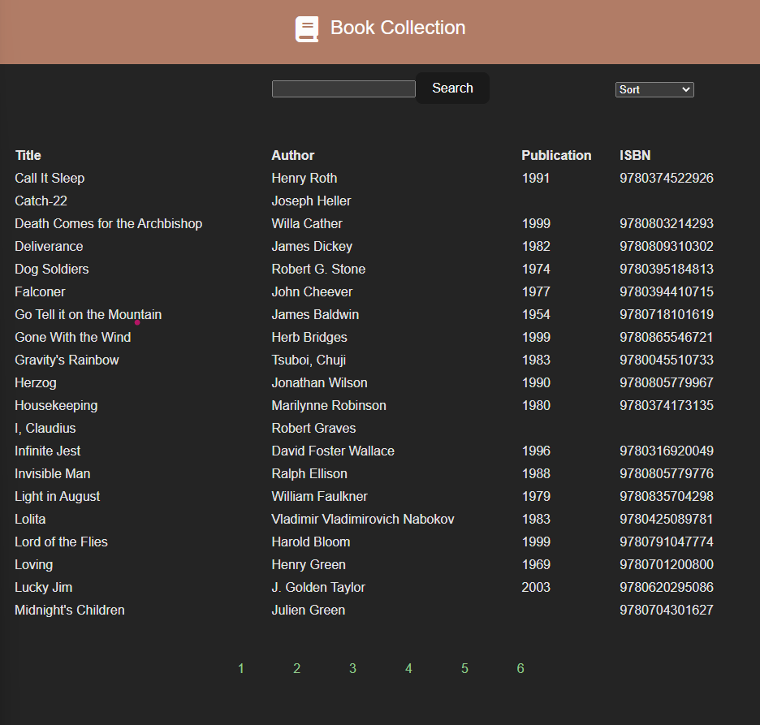

# Book Collection

I have created a React Book Collection Project. The books are retreived from an online API that returns a JSON object of famous books. I incorporated these books into my application once the page is mounted. My application contains several features such as:

-pagination of books into multiple pages
-search functionality based on keywords
-sorting based on newest, oldest, and alphabetically

Once someone searches for keywords, the number of pages is adjusted based on the number of search results. Also, I updated the app so that on search, the first page is rendered. Additionally, with each search, the sorting is updated to default rather than the previous chosen option. 

